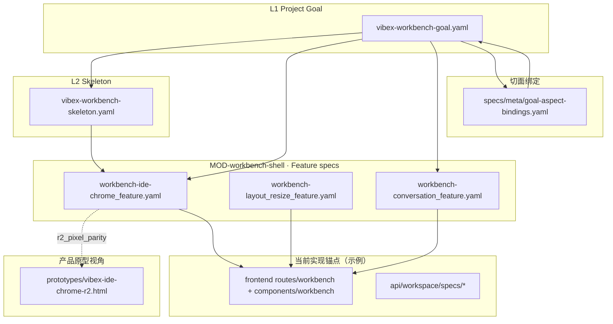

# VibeX Workbench：Goal 拆解与 Spec 关联图（维护说明）

本文档描述如何把 **L1 Project Goal** 拆成可落地的多视角视图，并把各视角 **挂接到仓库内既有 YAML spec、原型与代码区域**。  

**单一事实来源**：条款级约束与门禁仍以 **`specs/**/*.yaml`** 与各文件内锚点为准；本文是 **导航与拆解索引**，条款变更时请同步修订本页的「锚点路径」小节（或在本页注明「已迁至某 spec」），避免二手漂移。

### 目录层级与类型关联（机读约定）

- **约定文件**：`specs/meta/spec-directory-convention.yaml` —— 每种 spec 类型对应的 **目录 / glob / 命名习惯**，层级之间的 **association_links**，以及 **`parent_resolve`**（`spec.parent` 聚合名 → 权威 `target_path`，用于「打开 parent」优先查表，未列出再启发式）。
- **接口**：`GET /api/workspace/specs/convention` —— 返回 `{ source, convention }`，工作台可用来做类型徽章、推断关联、可视化边（仍以文件内 YAML 为准做交叉校验）。

---

## 1. 为什么要多视角拆解

| 视角 | 解决什么问题 | 主要读者 |
|------|----------------|----------|
| **Goal / 产品价值分层** | 内核治理 vs 自举证明 vs 体验面，验收不要混在一起 | 全员、评审 |
| **软件工程生命周期** | 从意图到交付的阶段、门禁与 todo 派生 | 实施、流程 |
| **技术选型与分层** | 栈与模块边界、集成点在哪里 | 前后端、Agent |
| **产品原型（UX）** | 区域职责、交互顺序、像素/Token 对齐依据 | 前端、设计对齐 |
| **主视图图谱（切面钻取）** | Goal → 切面 → 下游 spec 的路径，避免「改了一处不知牵连哪」 | Spec 作者、工作台实现 |

---

## 2. L1 Goal 内的「产品价值三层」

来源：`specs/project-goal/vibex-workbench-goal.yaml` → `content.product_value_layers`。

| 层 | 含义（摘要） | 与约束/里程碑的对应 |
|----|----------------|------------------------|
| **kernel_governance_and_agent** | Spec 治理 + Agent 在约束下迭代 | C1、C3、C7 等；下层见 `specs/feature/**`、`skeleton` |
| **proof_self_bootstrap** | 本仓自举证明规格体系可信 | C4；**M7** |
| **experience_visualization** | Canvas/SSE、壳层、spec 浏览与编辑体验 | C6；**M5/M6** 等 |

实施时：**不要**用「自举绿了」代替「IDE 壳层验收」，反之亦然——Goal 里已写明二者验收维度分离。

---

## 3. 软件工程视角：门禁单元与变更纪律

来源：`content.constraints`（C1–C8）、`content.spec_workflow_units`。

| 概念 | 含义 | 实操命令（本仓库） |
|------|------|---------------------|
| **最小单元** | L5d test-spec，局部 RED/GREEN | 对应模块下 `*_test.yaml` / 测试代码 |
| **总聚合门禁** | validate：整树一致才可作为生成输入 | `make validate`（或等价：`lint-specs` + `validate_chain`） |
| **变更 → todo** | 改 spec 须有据可查的后续任务 | `todo_set` / backlog；对齐 C7 |

---

## 4. 技术选型与模块分层（骨架）

来源：`specs/architecture/vibex-workbench-skeleton.yaml`。

- **Spec 层级映射**：见该文件 `content.level_mapping`（L1 Goal → L2 Skeleton → … → L5d）。
- **五模块（MOD）**：`MOD-spec-engine`、`MOD-dsl-visualizer`、`MOD-code-generator`、`MOD-workbench-shell`、`MOD-agent-router`（以骨架正文为准）。
- **生成与校验**：`generators/gen.py`、`Makefile` 中的 `generate` / `lint-specs` / `validate` 与 Goal 中「本仓优先证明」一致。

前端/Agent **落地入口**（便于 Code Search）：

| 区域 | 典型路径（随演进可能增加） |
|------|----------------------------|
| 工作台壳层（开发者维护） | `frontend/src/routes/workbench/+page.svelte`、`frontend/src/lib/components/workbench/*` |
| Workspace Spec API | `frontend/src/routes/api/workspace/specs/*`、`frontend/src/lib/server/*` |
| Agent | `agent/`、`agent/models.yaml`、配置见各 `README` / env |
| 原型（像素/信息架构锚点） | `prototypes/vibex-ide-chrome-r2.html` |

---

## 5. 产品原型视角：与 Feature Spec 的契约

**原型文件**：`prototypes/vibex-ide-chrome-r2.html` —— **信息架构与区域命名**的一等参考；**具体 CSS 变量、Grid、选择器**以 Feature 为准。

**权威 Feature**：

- **IDE Chrome（分区与区域职责）**：`specs/feature/workbench-shell/workbench-ide-chrome_feature.yaml`  
  - 含 `content.r2_pixel_parity`（对齐 R2 的 token / 布局约定）；扩展新区域须 **先改 spec 再实现**。
- **拖拽与几何**：`specs/feature/workbench-shell/workbench-layout_resize_feature.yaml`
- **对话 / SSE 侧栏语义**：`specs/feature/workbench-shell/workbench-conversation_feature.yaml`

原型视角的验收句式建议：**每条壳层能力** ↔ **原型中可指出的一块区域名** ↔ **feature 中的一条 behavior/io**。

---

## 6. 主视图图谱：切面 → 默认钻取路径

来源：

- Goal 内嵌：`content.goal_spec_visualization`（中心卡 + 切面径向图、分阶段 rollout）。
- **本仓绑定表（Phase 0）**：`specs/meta/goal-aspect-bindings.yaml`

该表把 **切面 id** 映射到 **默认打开的 spec 路径**；工作台「总目标图谱」UI 应 **读此表**，避免把路径写死在 TS 里。

下表为绑定文件的摘要（完整列表以 YAML 为准）：

| 切面 id | 标签（摘要） | 默认钻取目标 |
|---------|----------------|----------------|
| `product_and_demo` | 产品与演示 | `specs/feature/workbench-shell/workbench-ide-chrome_feature.yaml` |
| `l1_l2_lineage` | L1↔L2 衔接 | `specs/project-goal/vibex-workbench-goal.yaml`（`content.l1_l2_lineage`） |
| `architecture_and_code` | 架构与代码 | `specs/architecture/vibex-workbench-skeleton.yaml` |
| `quality_and_gates` | 质量与门禁 | `specs/project-goal/vibex-workbench-goal.yaml`（含 success_metrics 等段落） |
| `narrative_and_flow` | 叙事与对话 | `specs/feature/workbench-shell/workbench-conversation_feature.yaml` |
| `domain_ddd` / `data_and_consistency` / … | 待补占位 | 当前回落到 L1 或占位说明（见 bindings 内 `hint`） |

---

## 7. 端到端追溯关系（概念图）

下列 **Mermaid** 表达「从上到下的阅读与实现顺序」，不等价于运行时调用图。

---

## 8. 推荐阅读顺序（落地一条竖切时）

1. **L1**：`specs/project-goal/vibex-workbench-goal.yaml` —— mission、constraints、`product_value_layers`、里程碑段落。  
2. **L2**：`specs/architecture/vibex-workbench-skeleton.yaml` —— 模块与层级映射。  
3. **壳层 Feature**：`workbench-ide-chrome_feature.yaml` + `workbench-layout_resize_feature.yaml`。  
4. **切面表**：`specs/meta/goal-aspect-bindings.yaml` —— 若做「Goal 图谱」或导航。  
5. **原型**：打开 `prototypes/vibex-ide-chrome-r2.html` 对照区域名与 Tab 语义。  
6. **门禁**：改任意 `specs/**` 后跑 `make lint-specs` / `make validate`，并按 C7 处理 todo。

---

## 9. M0 执行：层级契约 + 范本 spec

- **契约（每层最低应含）**：`specs/meta/spec-layer-contract.yaml`（`layers.*.must_contain`）。  
- **M0 范本（先填再推广）**：
  - `specs/module/MOD-workbench-shell_module.yaml` — 已加 `content.vision_traceability`；并修正原 `io_contract.changelog` 的 YAML 嵌套错误。  
  - `specs/feature/workbench-shell/workbench-ide-chrome_feature.yaml` — 已加 `content.vision_traceability` + 验收摘要。  
- **推广顺序**：按 workbench-shell 子树 → 其它 `specs/module/*` → 各 `*_feature.yaml` 补同构段落；每批改后跑 `make lint-specs` / `make validate`（以本机 Makefile 路径为准）。

---

## 10. 修订记录

| 日期 | 说明 |
|------|------|
| 2026-04-22 | 初版：多视角拆解 + 与 goal / skeleton / shell feature / bindings / 原型的关联说明 |
| 2026-04-22 | 增补：`spec-directory-convention.yaml` + `/api/workspace/specs/convention` |
| 2026-04-22 | 增补：M0 `spec-layer-contract`、MOD/ide-chrome 范本与执行节 |
