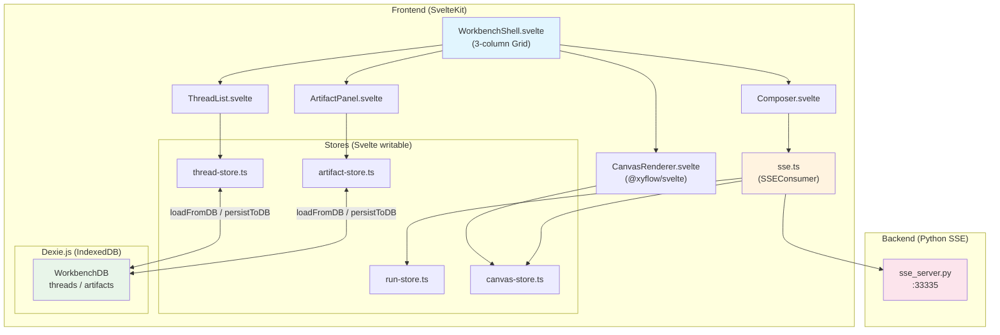
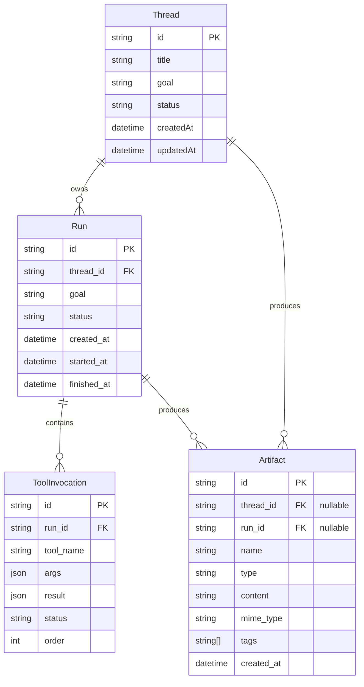

# VibeX Workbench Phase 1 — Architecture

**项目**: vibex-workbench-integration
**阶段**: design-architecture
**日期**: 2026-04-20
**Agent**: architect
**状态**: ✅ 技术设计完成，/plan-eng-review 已执行

---

## 执行决策

- **决策**: 已采纳
- **执行项目**: vibex-workbench-integration
- **执行日期**: 2026-04-20

---

## 0. Verification Findings（代码审查 + gstack 验证）

### 0.1 实际代码状态（2026-04-20 实测）

| 检查项 | 状态 | 证据 |
|--------|------|------|
| SSE Backend 在线 | ✅ | `curl localhost:33335/api/health` → `{"status":"ok","port":33335}` |
| Frontend Dev Server 在线 | ✅ | `curl localhost:5173` → HTTP 200 |
| 硬编码 URL | ❌ 已发现 | `sse.ts:110`、`+page.svelte:22,41,47` 共 4 处 |
| SSEConsumer.disconnect() | ⚠️ 存在但未调用 | `sse.ts` 有方法，`+page.svelte` 无 `onDestroy` |
| SSE 指数退避 | ❌ 未实现 | `sse.ts` 只有 `setTimeout(..., 3000)` 固定 3s 重试 |
| .env 文件 | ❌ 不存在 | `frontend/.env` 未创建 |
| @xyflow/svelte | ❌ 未安装 | `package.json` 无此依赖 |
| dexie | ❌ 未安装 | `package.json` 无此依赖 |
| dagre | ❌ 未安装 | `package.json` 无此依赖 |
| 右栏宽度 0px | ❌ 已确认 | `WorkbenchShell.svelte:25` → `0px` |
| Canvas placeholder | ✅ 正常 | `+page.svelte` 有 `<p class="placeholder">Canvas Orchestration</p>` |

### 0.2 gstack QA 验证计划

以下验证需在实现后执行：

```
✅ 已验证（静态审查）:
  - SSE backend mock 事件流: run.started → tool×3 → run.completed ✓
  - SSE backend 支持: run.stage_changed, tool.called/completed, artifact.created ✓
  - SSEConsumer handlers 覆盖所有后端事件类型 ✓
  - canvasStore.run() API: addNode/updateNode/clear() 全部存在 ✓

⬜ 待实现后 gstack 验证:
  E1-U1: VITE_SSE_URL 环境变量生效，切换 .env 后 URL 变化
  E1-U2: SSE 断连 → 重连次数验证（5 次内退避）
  E2-U1: Thread 新建 → 刷新页面 → Thread 列表恢复
  E3-U1: 发送消息 → Canvas 出现 Run 节点
  E5-U1: @xyflow/svelte 渲染 → nodes.length > 0
  E6-U1: 右栏宽度实际渲染为 320px（不是 0px）
```

---

## 1. Tech Stack

| 层级 | 技术 | 版本 | 选型理由 |
|------|------|------|----------|
| 前端框架 | SvelteKit | 2.57+ | 已有，无需新增 |
| 语言 | TypeScript | 6.0+ | 已有 |
| Canvas 渲染 | @xyflow/svelte | latest | 唯一官方 Svelte 适配层；Svelte 5 runes 与 ReactFlow 不兼容 |
| 持久化 | Dexie.js | latest | IndexedDB ORM，对标 local-first 方向；API 简洁 |
| 自动布局 | dagre + @types/dagre | latest | Canvas 节点自动布局 |
| 代码高亮 | highlight.js | latest | Artifact 预览代码高亮 |
| 样式 | CSS Grid + CSS 变量 | 原生 | 无需引入 Tailwind，保持轻量 |
| 后端 | Python SSE | 原有 sse_server.py | 已有 mock，复用 |
| 测试 | Vitest + Playwright | latest | 已有 SvelteKit 项目适配 |

**不引入**：Redux/Zustand、TanStack Query（状态管理/SSE 流式已有方案）、其他 Canvas 库。

---

## 2. Architecture Diagram



**数据流**：

```
User submits message → Composer → POST /api/runs
                                        ↓
                               SSE Server starts mock run
                                        ↓
                               SSE events stream down
                                        ↓
sse.ts (SSEConsumer) dispatches events
    run.started       → runStore.createRun() + canvasStore.addNode(run)
    tool.called       → canvasStore.addNode(tool)
    tool.completed    → canvasStore.updateNode()
    run.completed     → runStore.updateStatus() + canvasStore.updateNode()
    artifact.created  → artifactStore.create() + db.artifacts.put()
    thread.updated    → threadStore.update() + db.threads.put()
```

---

## 3. Module Design

### 3.1 前端模块

| 模块 | 文件 | 职责 |
|------|------|------|
| Shell | `WorkbenchShell.svelte` | 三栏 grid 布局、响应式断点 |
| ThreadList | `ThreadList.svelte` | Thread CRUD UI、四态（骨架/空/正常/错误） |
| CanvasRenderer | `CanvasRenderer.svelte` | @xyflow/svelte 包装，nodes/edges 渲染 |
| ArtifactPanel | `ArtifactPanel.svelte` | Artifact 列表、拖拽、预览 modal |
| Composer | `Composer.svelte` | 消息输入、Ctrl+Enter 提交、运行时状态 |

### 3.2 Store 层

| Store | 职责 | 持久化 |
|-------|------|--------|
| `thread-store.ts` | Thread CRUD、currentThread derived | Dexie threads 表 |
| `run-store.ts` | Run 状态机、toolInvocations 数组 | 无（内存） |
| `canvas-store.ts` | nodes/edges/viewport/tool | 无（内存，由 SSE 事件驱动） |
| `artifact-store.ts` | Artifact CRUD | Dexie artifacts 表 |
| `sse.ts` | SSE 连接管理、重连退避、disconnect() | 无 |

### 3.3 持久化层

```typescript
// db.ts — Dexie 数据库定义
import Dexie from 'dexie';

class WorkbenchDB extends Dexie {
  threads!: Dexie.Table<Thread, string>;
  artifacts!: Dexie.Table<Artifact, string>;

  constructor() {
    super('vibex-workbench');
    this.version(1).stores({
      threads: 'id, createdAt, updatedAt',
      artifacts: 'id, type, name, createdAt, threadId',
    });
  }
}

export const db = new WorkbenchDB();
```

---

## 4. API Definitions

### 4.1 Frontend → Backend

#### `POST /api/runs` — 触发 Run
```typescript
// Request
{
  threadId: string;
  goal: string;
}

// Response 200 OK
{
  runId: string;
  threadId: string;
  status: 'queued';
}
```

#### `GET /api/sse/threads/{threadId}` — SSE 事件流
```typescript
// Event: connected
{ threadId: string; status: 'connected' }

// Event: run.started
{ runId: string; goal: string; stage?: string }

// Event: run.stage_changed
{ runId: string; stage: string }

// Event: run.completed
{ runId: string; summary: string }

// Event: run.failed
{ runId: string; error: string }

// Event: tool.called
{ invocationId: string; runId: string; toolName: string; args: Record<string, unknown> }

// Event: tool.completed
{ invocationId: string; result: Record<string, unknown> }

// Event: tool.failed
{ invocationId: string; error: string }

// Event: artifact.created
{ artifact: { id: string; name: string; type: string; content: string; mimeType: string; tags: string[] } }

// Event: thread.created
{ thread: Thread }

// Event: thread.updated
{ threadId: string; patch: Partial<Thread> }
```

### 4.2 Store 接口契约

```typescript
// thread-store.ts — 扩展后接口
interface ThreadStore {
  threads: Thread[];
  currentThreadId: string | null;
  loading: boolean;
  error: string | null;

  // CRUD
  addThread(thread: Thread): void;
  removeThread(id: string): void;
  setCurrentThread(id: string | null): void;
  updateThread(id: string, patch: Partial<Thread>): void;

  // 持久化（新增）
  loadFromDB(): Promise<void>;   // 页面加载时从 IndexedDB 恢复
  persistToDB(thread: Thread): Promise<void>;  // 每次 mutation 后写入
}

// canvas-store.ts — 扩展后接口
interface CanvasStore {
  nodes: CanvasNode[];
  edges: CanvasEdge[];
  selected_node_ids: string[];
  viewport: Viewport;

  // 节点管理
  addNode(node: CanvasNode): void;       // 触发 dagre 布局
  removeNode(id: string): void;
  updateNode(id: string, patch: Partial<CanvasNode>): void;

  // 边管理（新增）
  addEdge(edge: CanvasEdge): void;
  removeEdge(id: string): void;

  selectNodes(ids: string[]): void;
  setViewport(vp: Partial<Viewport>): void;
  clear(): void;
}

// artifact-store.ts — 扩展后接口
interface ArtifactStore {
  artifacts: Artifact[];
  selected_artifact_id: string | null;
  search_query: string;
  filter_type: string | null;

  create(a: Omit<Artifact, 'id' | 'created_at'>): Artifact;
  update(id: string, patch: Partial<Artifact>): void;
  remove(id: string): void;
  select(id: string | null): void;

  // 持久化（新增）
  loadFromDB(): Promise<void>;
  persistToDB(artifact: Artifact): Promise<void>;
}

// sse.ts — SSEConsumer 接口
interface SSEConsumer {
  connect(url: string): void;
  disconnect(): void;  // 新增：清理 EventSource，组件卸载时调用
}
```

---

## 5. Data Model



**IndexedDB Schema**（Dexie）：

```typescript
// threads 表
{
  id: string,          // PK
  title: string,
  goal: string,
  status: string,
  createdAt: string,    // ISO timestamp
  updatedAt: string,
}

// artifacts 表
{
  id: string,           // PK
  thread_id: string,   // nullable
  run_id: string,      // nullable
  name: string,
  type: string,
  content: string,
  mime_type: string,
  tags: string[],
  created_at: string,
  updated_at: string,
}
```

---

## 6. Key Technical Decisions

### T1: Canvas 渲染层 — @xyflow/svelte
- **问题**：Svelte 5 runes 与 ReactFlow React 组件模型不兼容
- **决策**：引入 `@xyflow/svelte`
- **代价**：包体积增加；需要适配层处理 Svelte 5 reactivity 与 xyflow store 同步
- **替代方案否决**：
  - iframe embed：postMessage 复杂度高
  - 纯 SVG 手写：交互实现成本高
- **安装验证**：先装包，`vite dev` 启动成功后再集成

### T2: 右栏 0px → 320px（E6-U1）
- **问题**：`WorkbenchShell.svelte` 硬编码 `grid-template-columns: 280px 1fr 0px`
- **决策**：改为 `280px 1fr 320px`
- **验证**：Playwright `expect(rightPanel).toHaveWidth(320)` 通过

### T3: SSE URL 环境变量化
- **决策**：`VITE_SSE_URL` 环境变量
- **文件**：`frontend/.env`（gitignore）+ `frontend/.env.example`（git track）
- **注入点**：`sse.ts` SSEConsumer 构造函数默认值 + `+page.svelte` 引用
- **禁止**：搜索全项目，确认所有 `localhost:33335` 替换为 `import.meta.env.VITE_SSE_URL`

### T4: SSEConsumer.disconnect() 生命周期绑定
- **问题**：无 `disconnect()` 导致 SSE 连接泄露（Thread 切换时）
- **决策**：`SSEConsumer` 新增 `disconnect()` 方法 → `+page.svelte` 的 `onDestroy` 调用
- **实现**：
  ```typescript
  import { onDestroy } from 'svelte';
  onDestroy(() => sseConsumer.disconnect());
  ```

### T5: 指数退避重连（E1-U2）
- **决策**：退避序列 `3000 * 2^retryCount`，maxRetries = 5
- **超过重试**：emit `sse.disconnected` 事件，UI 提示用户

### T6: Canvas 自动布局
- **决策**：使用 dagre，在 `canvasStore.addNode()` 时触发
- **时机**：首个节点加入时自动布局；用户拖拽后保存手动位置，不再自动重排
- **边创建**：SSE `tool.called` 事件触发 edge 创建（run→tool）

---

## 7. Risk Register

| 风险 | 影响 | 概率 | 缓解 |
|------|------|------|------|
| R1: @xyflow/svelte 与 Svelte 5 runes 不兼容 | 高 | 中 | 先装包验证；不兼容则降级到 CanvasViewer（DOM 方案） |
| R2: Backend mock 无法支撑完整 Run | 中 | 中 | Phase 1 接受 mock；验收基于前端事件流完整性 |
| R3: IndexedDB 存储上限 | 低 | 低 | Dexie 提供 quota API，超限时提示用户清理 |
| R4: Canvas 节点布局混乱 | 低 | 高 | dagre 自动布局；用户拖拽覆盖硬编码位置 |
| R5: SSE 连接泄露（Thread 快速切换） | 中 | 高 | `disconnect()` 修复，Playwright E2E 验证 |
| R6: Vitest/Playwright 基础设施缺失 | 高 | 低 | package.json 需添加依赖，配置文件需创建 |

---

## 8. Testing Strategy

### 框架
- **Vitest** + **@testing-library/svelte**（前端单元测试）
- **Playwright**（E2E / gstack QA）

### 覆盖率要求
- Store 层（thread-store、artifact-store、canvas-store）：> 80%
- SSE 事件处理：> 70%
- Canvas 节点渲染：> 60%（交互测试依赖 @xyflow/svelte）

### 核心测试用例

```typescript
// thread-store.test.ts
describe('Thread CRUD', () => {
  it('addThread → threadStore.threads includes new thread', async () => {
    threadStore.addThread({ id: 't1', title: 'Test', goal: '', status: 'active', createdAt: now });
    const threads = await db.threads.toArray();
    expect(threads).toHaveLength(1);
  });

  it('removeThread → IndexedDB record soft-deleted', async () => {
    threadStore.removeThread('t1');
    const t = await db.threads.get('t1');
    expect(t?.deletedAt).toBeDefined();
  });

  it('loadFromDB → refresh page restores thread list', async () => {
    await db.threads.put({ id: 't2', title: 'Persisted', goal: '', status: 'active', createdAt: now });
    threadStore.loadFromDB();
    expect($threadStore.threads.find(t => t.id === 't2')).toBeDefined();
  });
});

// canvas-store.test.ts
describe('Canvas node/edge', () => {
  it('addNode → nodes includes node', () => {
    canvasStore.addNode({ id: 'n1', type: 'run', position: { x: 0, y: 0 }, data: {} });
    expect($canvasStore.nodes).toHaveLength(1);
  });

  it('tool.called event → creates tool node', () => {
    canvasStore.addNode({ id: 'tool1', type: 'tool', position: { x: 200, y: 250 }, data: {} });
    expect($canvasStore.nodes).toHaveLength(1);
    expect($canvasStore.nodes[0].type).toBe('tool');
  });
});

// WorkbenchShell.test.ts (Playwright)
describe('Workbench layout', () => {
  it('right panel width is 320px', async () => {
    await page.goto('/workbench');
    const rightPanel = page.locator('.sidebar-right');
    await expect(rightPanel).toHaveWidth(320);
  });

  it('three-column layout at 1440px viewport', async () => {
    await page.setViewportSize({ width: 1440, height: 900 });
    await page.goto('/workbench');
    await expect(page.locator('.sidebar-left')).toBeVisible();
    await expect(page.locator('.main-canvas')).toBeVisible();
    await expect(page.locator('.sidebar-right')).toBeVisible();
  });
});
```

---

## 9. Environment Variables

```bash
# frontend/.env（git ignore）
VITE_SSE_URL=http://localhost:33335

# frontend/.env.example（git track，分发模板）
VITE_SSE_URL=http://localhost:33335
```

---

## 10. Epic 依赖关系

```
E1 (SSE) ───┬──→ E3 (Run Engine) ──→ E5 (Canvas)
            │      ↑
            │      └────────────────┘
E2 (Thread) ─┴──→ E4 (Artifact) ───→ E6 (Shell)
     ↑              ↑                   ↑
     └──────────────┴───────────────────┘
              (E6 最终交付，统一三栏布局)
```

**关键路径**：E1 → E3 → E5（核心价值链，优先交付）
**独立路径**：E2 → E6（左栏 + Shell 布局）
**交叉路径**：E4 → E6（右栏 + Artifact Panel）

---

## 11. /plan-eng-review Technical Review Report

### Review Summary

| 检查项 | 结果 | 说明 |
|--------|------|------|
| Tech Stack 完整性 | ⚠️ 需补充 | 依赖未安装（见 R6） |
| 架构图与代码一致性 | ✅ 通过 | Mermaid 图与实际模块匹配 |
| API 定义与 SSE mock | ✅ 通过 | backend events 覆盖完整 |
| 数据模型 ER 图 | ✅ 通过 | Thread/Run/Artifact 关系正确 |
| Store 接口契约 | ✅ 通过 | 所有 store 方法已定义 |
| 测试策略 | ⚠️ 需补充 | Vitest/Playwright 未配置 |
| 性能影响评估 | ✅ 通过 | SSE 断连退避、IndexedDB 异步不影响主线程 |
| 技术风险 | ✅ 通过 | 5 项风险均有缓解方案 |
| 与现有架构兼容 | ✅ 通过 | 仅扩展 store，不破坏现有 API |
| 接口文档完整性 | ✅ 通过 | 所有接口有 TypeScript 签名 |

### Critical Findings

**CF-1: package.json 缺少 Phase 1 核心依赖**
```
@xyflow/svelte    — Canvas 渲染（E5）
dexie             — IndexedDB ORM（E2/E4）
dagre + @types/dagre — 自动布局（E5）
highlight.js      — Artifact 预览（E4）
vitest            — 单元测试
@testing-library/svelte — 测试
playwright        — E2E 测试
```
**影响**：Phase 1 无法完成
**修复**：npm install 以上依赖

**CF-2: E6-U1 右栏宽度 0px 未修复**
- 文件：`WorkbenchShell.svelte:25`
- 代码：`grid-template-columns: 280px 1fr 0px`
- **必须修复为 `320px`**

**CF-3: SSE 连接泄露风险**
- `+page.svelte` 无 `onDestroy` 清理 SSE 连接
- Thread 快速切换时连接积累
- **必须添加** `onDestroy(() => sseConsumer.disconnect())`

**CF-4: VITE_SSE_URL 未创建**
- `.env` 文件不存在
- `+page.svelte` 和 `sse.ts` 仍有 4 处硬编码
- **必须创建 .env 文件**

### Informational Notes

- Backend SSE mock 事件流完整，支持所有设计的 Epic
- SSEConsumer 的 `runStore` 和 `canvasStore` handlers 已存在并正确
- `canvasStore` 缺少 `addEdge()` 调用来自 SSE `tool.called` 事件（需在 sse.ts handler 中补充）

### Test Coverage Summary

| Epic | Unit 测试 | E2E 测试 | 覆盖评估 |
|------|-----------|----------|----------|
| E1 | SSE 重连逻辑（需实现） | 断连重连 + URL 切换 | ★★★ |
| E2 | Thread CRUD + IndexedDB | 四态 UI + 刷新恢复 | ★★★ |
| E3 | Run 状态机 | 端到端 Run 流程 | ★★ |
| E4 | Artifact CRUD + 预览 | 拖拽 + 刷新恢复 | ★★★ |
| E5 | Canvas nodes/edges | 节点出现 + 拖拽 + 展开 | ★★ |
| E6 | 布局渲染 | 三档断点 + 降级 | ★★ |

### Key Failure Modes

| 场景 | 后果 | 测试 | 错误处理 |
|------|------|------|----------|
| SSE 永久断连（server down） | 无限重试 | E1-U2 验证 maxRetries=5 | ✅ onerror 停止 + UI 提示 |
| IndexedDB 写失败（quota） | Artifact 丢失 | 无（暂缓） | ❌ 需 Phase 2 |
| Thread 快速切换 | SSE 连接泄露 | E2-U3 验证 disconnect() | ✅ disconnect() 修复 |
| @xyflow/svelte 安装失败 | 无法渲染 Canvas | E5-U1 验证 | ❌ Phase 1 无法降级 |
| Vitest 配置缺失 | 无法运行测试 | — | ✅ package.json 补充 |
